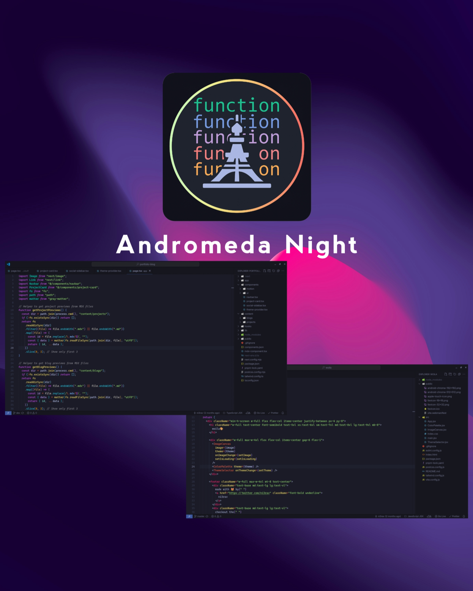

# Andromeda Night Theme for VS Code

A VS Code theme that fuses the vibrant syntax highlighting of Andromeda with the elegant palette of Tokyo Night, for a visually stunning and comfortable coding experience.

> Tip: For better experience use fonts with italic ligature with italic variant(I'd recommend using Cascadia Code Nerd Font)

## Variants

This theme comes in four variants:

- **Andromeda Night** - The classic variant featuring vibrant Andromeda syntax with Tokyo Night's elegant palette
- **Andromeda Night Italic** - Same as the classic variant with italic font styling for enhanced readability
- **Andromeda Night Equalizer** - A stealth variant with monochrome colors over Tokyo Night's base for a minimal, distraction-free coding experience
- **Andromeda Night Dusk** - A warm, dusk-inspired variant with softened sunset tones for a calmer, evening-friendly coding experience

## Installation

1. Open the extensions sidebar in Visual Studio Code
2. Search for **Andromeda Night**
3. Click **Install**
4. Reload your editor
5. Preferences > Color Theme > **Andromeda Night** (or choose your preferred variant)

## Credits

- [Andromeda](https://github.com/EliverLara/Andromeda)
- [Tokyo Night](https://github.com/tokyo-night/tokyo-night-vscode-theme)

## License

[MIT License](./LICENSE)

Enjoy! :) 😺
